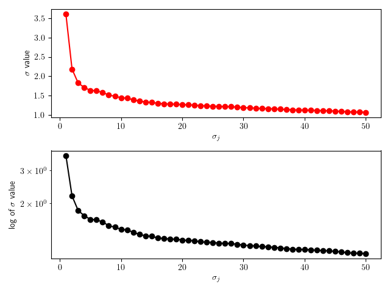
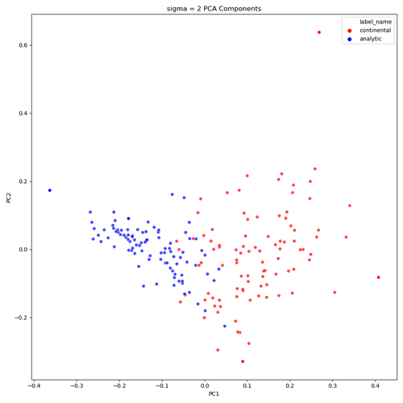

[](https://GitHub.com/Naereen/ama)
[](https://www.python.org/)


# Classifying Philosophy Papers As 'Good,' 'Bad,' 'Continental,' and 'Analytic'

This project is an experiment to see if simple, statistical classifier methods could be used to classify a relatively small corpus of philosophy papers. [Here](https://github.com/tyarosevich/NLP_philosophy_classifier/blob/master/Final_Presentation/philosophy_paper_classif_pres.pdf) is a presentation on the project, including visualization, methods, and background.

# Motivation

This project was originally begun to satisfy the final project in AMATH 582 at the University of Washington, in the Applied Mathematics department. This is a graduate course on scientific computing, data analysis, and machine learning that focuses on signal processing and multivariate analysis.

# Contributing

This is a simple experiment in NLP. Pull requests are welcome, though the nature of the project is highly specific. The corpus is not open license, and while I am licensed to access it, I cannot share it.

# Framework

- Python 3.7
- Numpy
- NLTK 3.5
- SKLEARN 0.23.1

# Figure Examples




# Code Example
```
#%% Classify with KNN, Part 1
from sklearn.neighbors import KNeighborsClassifier
from sklearn.metrics import classification_report, confusion_matrix, accuracy_score

neigh = KNeighborsClassifier(n_neighbors=1)
neigh.fit(features_train1, labels_train1)
predict1 = neigh.predict(features_test1)

# Training accuracy
print("The training accuracy is: ")
print(accuracy_score(labels_train1, neigh.predict(features_train1)))

# Test accuracy
print("The test accuracy is: ")
print(accuracy_score(labels_test1, predict1))
```